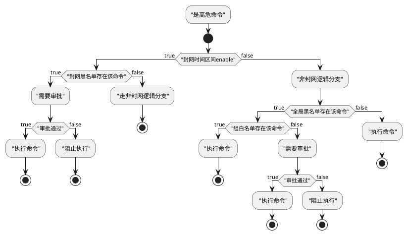

# Welcome to my knowledge repository

## design of 

```puml
@startuml
:"是高危命令";
start
if ("封网时间区间enable") then (true)
	if ("封网黑名单存在该命令") then (true)
	:"需要审批";
		if ("审批通过") then (true)
		: "执行命令";
		stop
		else (false)
		: "阻止执行";
		stop
		endif
	else (false)
	: "走非封网逻辑分支";
	stop
	endif	
else (false)
	:"非封网逻辑分支";
	if ("全局黑名单存在该命令") then (true)
		if ("组白名单存在该命令") then (true)
			:"执行命令";
			stop
		else (false)
			:"需要审批";
			if ("审批通过") then (true)
				: "执行命令";
				stop
			else (false)
				: "阻止执行";
				stop
			endif
		endif
	else (false)
		: "执行命令";
		stop
	endif
@enduml
```